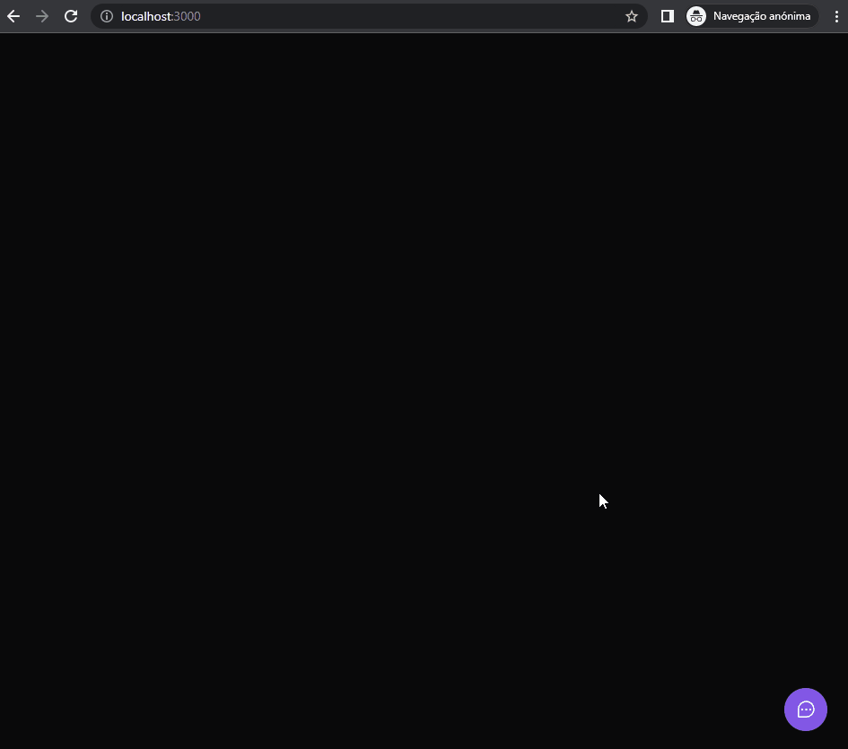

<h1>Feedget - Frontend com React ( README em construção )</h1>

Projeto da nlw da rocketseat

 
<h2 id="tools">🛠️ Ferramentas</h2>

<ul>
<li>React</li>
<li>Phosphor-react</li>
<li>Tailwind css</li>
</ul>

 
<h2 id="project">🎥 Veja o projeto</h2>

 
<kbd></kbd>